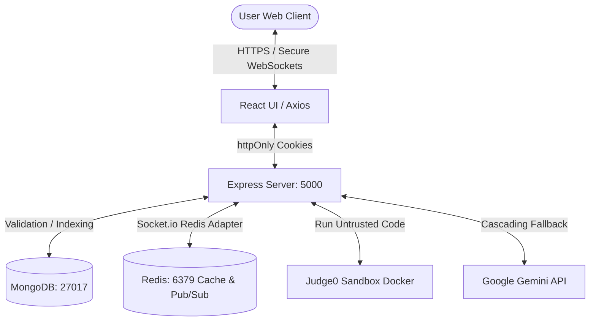

# 🛡️ DevPrep AI - AuthX Suite & Elite Prep Platform

> **Elite Technical Coding Mastery, Interactive AI Mock Interviews, & Enterprise-Grade Security for Software Engineers**

DevPrep AI is a high-performance, professional coding preparation and mock interview platform architected for developers who demand elite-tier technical preparation. It combines advanced AI logic diagnostics, interactive voice-to-voice mock interviews, secure Dockerized execution infrastructure, and a premium, responsive glassmorphic React interface.

---

## 💎 Features at a Glance

### 1. 🤖 AI-Core Mastery Services
* **AI Practice Interview**: Engage with a virtual Senior Engineer agent utilizing real-time WebSockets (Socket.io) typing synchronization and speech evaluation.
* **Voice-to-Voice Behavioral & Technical Mock Interviews**: A structured 5-question mock interview simulating real-world conversational evaluation.
* **Logic Explainer**: AI deeply traces uploaded code fragments line-by-line to explain "why" code works, targeting JS/TS, Python, C, C++, and Java.
* **Bug Fix Mode**: Hunt down and correct subtle syntactic and logical bugs in predefined buggy templates with the AI validating the fixes.
* **System Design Architect**: Interactive mock System Design assessments that evaluate scalability decisions (e.g., Load Balancers, Redis, Database choices, Caching).
* **AI Complexity & Review Analysis**: Real-time evaluation of time/space complexity ($O(N)$ notation) and detailed reviews for user submissions, referencing past developer mistakes.

### 2. 🔐 Enterprise AuthX Security & Hardening
* **Dual-Token JWT Architecture**: Employs short-lived Access Tokens (15m) paired with robust Refresh Tokens (7d) stored securely in `httpOnly` cookies to strictly prevent XSS.
* **Broken Object-Level Authorization (IDOR) Protection**: Verifies document ownership (checking Mongoose `userId` equality) on user-specific mutations such as solutions synchronization, interview turns, and session completions.
* **Cross-Site Request Forgery (CSRF) Defenses**: Global middleware validating request Origin and Referer headers against the authorized frontend origin for all state-changing mutations.
* **OAuth CSRF Callback Safeguards**: Uses secure HTTP-only cookies (`github_state` and `github_user_id`) storing randomized states to validate social credentials linking.
* **Credential Data Encryption At-Rest**: Encrypts sensitive credentials (like third-party GitHub OAuth tokens) inside MongoDB using AES-256-CBC with legacy plaintext fallback support.
* **Input Sanitization Middleware**: Sanitizes raw incoming payloads to neutralize NoSQL injection attempts by removing operators beginning with `$` or `.`.
* **Platform Governance & Control**: Real-time admin maintenance overlays and signup restriction guards controlled globally through database configuration switches.
* **Strict Admin Isolation**: Administrative tools and management endpoints are strictly restricted to authenticated accounts matching email `sailokeshnalabothu@gmail.com` with the `admin` role.
* **Password Strength Enforcement**: Validates user password attributes during sign-up (length 8-12 characters, requiring uppercase, lowercase, numbers, and special characters; cannot contain the user's name/email).
* **Email Verification (OTP)**: Secure 6-digit initialization codes generated via crypto utilities and sent using Nodemailer.

### 3. 🚀 Platform Optimizations
* **Dockerized Code Execution Sandbox**: Safe execution of untrusted user-submitted source codes using local `Judge0` containers, backed by a pre-execution malicious code keyword pattern scanner.
* **React Lazy Loading & Suspense**: Dynamically splits and lazy-loads resource-intensive libraries (such as the Monaco Editor and heavy mock interview assets) to achieve near-instantaneous initial paint times.
* **O(1) Compound Database Indexing**: Submissions schema mapped with compound indices on `{ userId: 1, questionId: 1 }` ensuring instant lookup times.
* **Redis Caching & Scaling Mesh**: 
  - Centralized **Redis Caching** for AI evaluations to save API quota limits.
  - Centralized **Redis Pub/Sub Socket.io Adapter** to allow horizontal scaling across multiple Node.js server processes.

---

## 🏗️ Core Architecture Topology



---

## 📁 Repository Directory Structure

```
devprep-ai/
├── docker-compose.yml              # Docker Compose services configuration
├── README.md                       # Root repository documentation
├── INTERVIEW_PREP.md               # Interview defense and preparation guide
├── backend/                        # Node.js Express server codebase
│   ├── server.js                   # Application entry point
│   ├── config/                     # Configuration files
│   │   ├── db.js                   # Database initialization and indexing configurations
│   │   └── passportConfig.js       # Passport Google OAuth strategy configurations
│   ├── controllers/                # Request handlers
│   │   ├── authController.js       # Signup, Login, OTP Verification, Tokens refresh handlers
│   │   ├── debugController.js      # Handlers for fetching/verifying Bug Fix questions
│   │   ├── interviewController.js  # Starts, runs, and completes interview sessions
│   │   ├── leaderboardController.js# Retrieves rankings from database
│   │   ├── questionController.js   # CRUD handlers for programming questions
│   │   ├── settingsController.js   # Public and administrative system settings handlers
│   │   ├── submissionController.js # Handles runs, test-case evaluations, and GitHub sync
│   │   └── userController.js       # User profile details and admin management
│   ├── middleware/                 # Route guards
│   │   ├── admin.js                # Requires admin role validation
│   │   ├── authMiddleware.js       # Validates JWT tokens
│   │   ├── csrfMiddleware.js       # Validates Origin and Referer headers
│   │   └── mongoSanitize.js        # Sanitizes inputs from NoSQL injections
│   ├── models/                     # Mongoose schemas
│   │   ├── User.js                 # User profile, credentials, and OAuth tokens
│   │   ├── Question.js             # Challenges difficulty, test cases, and solution mappings
│   │   ├── Submission.js           # Submissions metadata, status, and AI reviews
│   │   ├── Interview.js            # Mock interview chats, status, and scores
│   │   └── Settings.js             # Maintenance and signup toggles
│   ├── services/                   # Business and API operations
│   │   ├── aiService.js            # Google Gemini client with caching and cascading fallbacks
│   │   ├── analysisService.js      # Aggregates user performance metrics
│   │   ├── cacheService.js         # Redis caching wrapper
│   │   ├── codeRunner.js           # Judge0 executor with sandbox security pattern validation
│   │   ├── cryptoService.js        # AES-256-CBC encryption for external tokens
│   │   ├── debugService.js         # System logs diagnostics and checks
│   │   ├── githubService.js        # GitHub API repository creation and file syncing
│   │   ├── interviewService.js     # Manages Websocket and voice interview state logic
│   │   ├── nodeMailerService.js    # Nodemailer email distribution engine
│   │   └── securityService.js      # Plagiarism check algorithms
│   └── scripts/                    # Command-line utility scripts
│       └── test-security.js        # Runs automated checks verifying CSRF/IDOR defenses
└── frontend/                       # React client application codebase
    ├── package.json                # Frontend dependencies configuration
    ├── tailwind.config.js          # Tailwind CSS presets configuration
    ├── postcss.config.js           # CSS post-processing configuration
    ├── public/                     # Static client files
    └── src/                        # React source components
        ├── App.js                  # Routing map and layout controls
        ├── App.css                 # Route navigation style overrides
        ├── index.js                # Client mount bootstrap file
        ├── index.css               # Global Tailwind CSS variables and custom Apple theme
        ├── components/             # Reusable elements
        │   ├── ActivityHeatmap.js  # Displays grid-based code commits counts
        │   ├── SkillsRadar.js      # Interactive radar progress chart
        │   ├── RobotAvatar.js      # Visual feedback status indicator for AI interactions
        │   ├── Navbar.js           # Application header component
        │   ├── Sidebar.js          # Scroll-safe collapsible navigation dashboard sidebar
        │   ├── ProtectedRoute.js   # Client authentication routing shield
        │   └── MaintenanceGuard.js # Global overlay blocking pages when maintenance is active
        ├── services/               # Frontend API clients
        │   └── api.js              # Centralized Axios instance configuration
        └── pages/                  # Route view components
            ├── Login.js / Signup.js# Authentication views
            ├── VerifyOTP.js        # Submits Nodemailer verification code
            ├── Dashboard.js        # Progress visual metrics and recent listings dashboard
            ├── Questions.js        # Challenge selector listing with search and tags filter
            ├── Editor.js           # Monaco coding editor environment with Vim bindings
            ├── MockInterview.js    # Interactive Socket.io chat room with Web Speech recognition
            ├── BugFixMode.js       # Code correction layout with Monaco editor
            ├── ExplainCode.js      # Code explanations uploader
            ├── SystemDesign.js     # Text-based systems design evaluation
            ├── Leaderboard.js      # Competitive ranking dashboard
            ├── Submissions.js      # Comprehensive list of historical submissions
            ├── Profile.js          # Handles details edits and GitHub linkages
            ├── VerifiedStatus.js   # Profile verification summary
            ├── FeatureBeta.js      # Feature placeholders layout
            ├── AdminDashboard.js   # High-level server parameters controls panel
            ├── ManageUsers.js      # Administrator list with role updates
            ├── UserStats.js        # Detailed student analytics visual tracker
            └── GovernanceSettings.js# Toggle controls for maintenance parameters
```

---

## 🛠️ Complete Technology Stack

| Component | Technology | Key Use Cases |
| :--- | :--- | :--- |
| **Frontend Core** | React 19.2, React Router 7.1 | Core UI structure, lazy route loading, layout states. |
| **Styling** | Tailwind CSS 3.4 | Glassmorphic, responsive, Apple-style dark design (`#090a0f`). |
| **Code Editor** | Monaco Editor, monaco-vim | In-browser VS Code editing, optional Vim keybindings toggle. |
| **Data Visuals** | Recharts 3.8 | Activity heatmap, skills radar charts, and stats. |
| **WebSockets** | Socket.io-client 4.8 | Low-latency chat streaming for AI mock interviews. |
| **Backend Core** | Node.js, Express 5.2 | Scalable APIs, custom router middlewares, WebSockets. |
| **Database** | MongoDB, Mongoose 9.3 | User data, submissions logging, questions inventory. |
| **Caching & Mesh** | Redis 5.11, `@socket.io/redis-adapter` | AI content caching, multi-node WebSockets horizontal scaling. |
| **Execution Engine** | Judge0, Postgres | Virtual containerized code compiler sandbox. |
| **AI Integration** | Google Gemini API (`@google/generative-ai` 0.24) | Step-by-step hints, reviews, complexity parsing, mock interviewing. |
| **Authentication** | Passport.js 0.7, JWT 9.0, bcryptjs 3.0 | Secure session cookies, password hashing, Google OAuth. |
| **Notifications** | Nodemailer 8.0 | Verification OTP delivery using email templates. |

---

## 📋 Comprehensive Database Models

### 1. `User` (`models/User.js`)
* **Fields**: Name, date of birth, gender, college, professional summary, permanent & current addresses, education details (school, degree, year, metrics), work experiences (role, company, duration, description), projects list, accomplishments list, email, hashed password, role (`user`/`admin`), verification flag (`isVerified`), OTP code and expiration times, refresh token payload, Google ID, GitHub token (encrypted), GitHub username, creation timestamp, and a structured array tracking the developer's historical mistakes.
* **Hooks**: Hashes passwords on save. Automatically elevates accounts matching `sailokeshnalabothu@gmail.com` to `admin` role.

### 2. `Question` (`models/Question.js`)
* **Fields**: Title, detailed descriptions, difficulty level (`Easy`, `Medium`, `Hard`), category tags, targeted companies, function validation name (`functionName`), and a nested array of test cases matching inputs and expected outputs.
* **Indices**: Indexing on `difficulty` and `companies` attributes for fast dashboard filtering.

### 3. `Submission` (`models/Submission.js`)
* **Fields**: User reference, question reference, source code body, selected language, final evaluation status (e.g. `Accepted`, `Wrong Answer`, `Compilation Error`), GitHub sync state, generated GitHub repository URL, plagiarism assessment score, calculated complexity parameters (time & space complexity), AI code review notes, and AI explanation text.
* **Indices**: Compound index on `{ userId: 1, questionId: 1 }` for rapid queries, and standard descending index on `createdAt`.

### 4. `Interview` (`models/Interview.js`)
* **Fields**: User reference, question reference, session topic, status (`ongoing`, `completed`, `absent`), chronologically sorted chat history (roles: `interviewer`/`user`/`system`), code snapshot on completion, feedback scorecard (scores, technical feedback comments, behavioral comments, confidence ratings), start time, and end time.

### 5. `Settings` (`models/Settings.js`)
* **Fields**: System maintenance mode status flag, custom maintenance message text, maintenance window schedules (start and end dates), signup permissions switch (`allowSignup`), and OTP initialization settings switch (`requireOTP`).

---

## 🔌 API Registry

### 1. Authentication Routes (`/api/auth`)
* `POST /signup` - Registers users with name, email, and password (after password security checks). Sends OTP.
* `POST /verify-otp` - Validates the 6-digit Nodemailer verification code and initializes the user session.
* `POST /login` - Verifies email/password and returns secure, HTTP-only authentication cookies (`token` and `refreshToken`).
* `POST /logout` - Clears the secure HTTP-only session cookies and removes token records.
* `POST /refresh-token` - Reads the HTTP-only refresh token to issue a new short-lived access cookie.
* `POST /forgot-password` - Sends a password reset token to the registered email address.
* `POST /reset-password` - Validates the reset token and updates the user's password.
* `GET /google` - Redirects users to Google's passport authentication consent window.
* `GET /google/callback` - Callback target handling post-consent tokens issuance and redirecting to the user dashboard.

### 2. User & GitHub Integration Routes (`/api/users`)
* `GET /profile` - Fetches authenticated user profile, calculating a unique year-based Enrollment ID.
* `PUT /profile` - Updates profile details (personal summary, addresses, experiences, education, custom avatars).
* `GET /` `[Admin]` - Fetches a list of all registered platform users.
* `PUT /:id/role` `[Admin]` - Promotes/demotes user roles.
* `DELETE /:id` `[Admin]` - Permanently deletes a user record.
* `GET /github/auth` - Sets secure OAuth states and redirects the client to GitHub OAuth authentication window.
* `GET /github/callback` - Callback verification target that encrypts and saves GitHub credentials in MongoDB.
* `GET /:id/stats` `[Admin]` - Aggregates a specific user's performance metrics, submissions logs, languages, and AI recommendations.
* `GET /:id/submissions` `[Admin]` - Retrieves a full log of coding submissions for a specific user.

### 3. Coding Question Routes (`/api/questions`)
* `GET /` - Retrieves questions bank, optionally filtering by categories and search tags.
* `GET /daily` - Fetches the designated question of the day.
* `GET /company/:company` - Filters questions based on specific tech companies.
* `GET /:id` - Fetches detailed configuration specs and boilerplates for a single question.
* `POST /add` `[Admin]` - Creates a new coding problem with test cases and descriptions.
* `PUT /:id` `[Admin]` - Modifies an existing question schema.
* `DELETE /:id` `[Admin]` - Removes a question from the platform.

### 4. Code Execution & Submissions Routes (`/api/submissions`)
* `POST /run` - Executes code on custom inputs within the Judge0 sandbox (without database logging).
* `POST /submit` - Evaluates code against problem test cases via Judge0, checks plagiarism, logs results, and streams real-time AI code review reviews, complexities, and explanations using Server-Sent Events (SSE).
* `POST /sync/:submissionId` - Syncs a validated solution code to the developer's public `DevPrep-Solutions` GitHub repository.
* `GET /my-submissions` - Retrieves a history of all code submissions by the user.
* `GET /solved` - Retrieves all questions successfully solved by the user.
* `GET /activity` - Returns submission count records aggregated by day.
* `GET /hints/:questionId` - Returns AI-generated hints (Idea -> Approach -> Pseudocode).
* `POST /explanation` - Returns step-by-step AI reviews explaining the logic of a solution.
* `POST /complexity` - Analyzes code to return time and space complexity information.
* `GET /analyze` - Requests AI analysis on user performance indicators.

### 5. AI Mock Interview Routes (`/api/interview`)
* `POST /start` - Starts a coding or voice behavioral mock interview session and returns the AI's opening question.
* `POST /:interviewId/turn` - Sends a user message, snapshot code, or transcript to get the AI interviewer's response.
* `POST /:interviewId/complete` - Completes the session, saves a code snapshot, and outputs an assessment scorecard (score, technical/behavioral feedback, confidence).

### 6. System Settings Routes (`/api/settings`)
* `GET /public` - Fetches current maintenance mode status and custom message banners.
* `GET /` `[Admin]` - Fetches complete settings schemas (including signup and OTP controls).
* `PUT /` `[Admin]` - Modifies system configuration values.

### 7. Leaderboard Routes (`/api/leaderboard`)
* `GET /` - Fetches leaderboard stats, ranking users by solved counts.

### 8. System Diagnostics & Debug Routes (`/api/debug`)
* `GET /system/elite-status` - Runs a diagnostic check checking Redis state, Gemini API availability, and database connectivity.
* `GET /:id` - Fetches a buggy code puzzle template.
* `POST /:id/analyze` - Checks a user's code repair attempt and provides feedback.

---

## 🚀 Setup & Local Development Guide

### 1. Infrastructure Boot (Docker Compose)
Launch the platform's infrastructure dependencies (MongoDB, Redis, Postgres, and the Judge0 Sandbox Compiler):
```bash
# Verify Docker Desktop is running, then execute:
docker-compose up -d
```

### 2. Backend Server Setup
1. Navigate to the backend directory and install dependencies:
   ```bash
   cd backend
   npm install
   ```
2. Create a `.env` configuration file matching the following settings:
   ```env
   PORT=5000
   MONGODB_URI=mongodb://127.0.0.1:27017/devprepAI
   JWT_SECRET=your_jwt_secret_hash_here
   REFRESH_TOKEN_SECRET=your_refresh_secret_hash_here
   EMAIL_USER=your_smtp_gmail_username@gmail.com
   EMAIL_PASS=your_smtp_gmail_app_password
   GOOGLE_CLIENT_ID=your_google_cloud_oauth_client_id
   GOOGLE_CLIENT_SECRET=your_google_cloud_oauth_client_secret
   GITHUB_CLIENT_ID=your_github_developer_oauth_client_id
   GITHUB_CLIENT_SECRET=your_github_developer_oauth_client_secret
   REDIS_URL=redis://127.0.0.1:6379
   GEMINI_API_KEY=your_google_gemini_api_key
   JUDGE0_URL=http://localhost:8000
   FRONTEND_URL=http://localhost:3000
   ```
3. Run the development server (runs with nodemon):
   ```bash
   npm run dev
   ```

### 3. Frontend Client Setup
1. In a new terminal window, navigate to the frontend directory and install dependencies:
   ```bash
   cd frontend
   npm install
   ```
2. Run the React development server:
   ```bash
   npm start
   ```
3. Open [http://localhost:3000](http://localhost:3000) in your web browser.

**Built for Excellence by the DevPrep AI Team 💙.**
